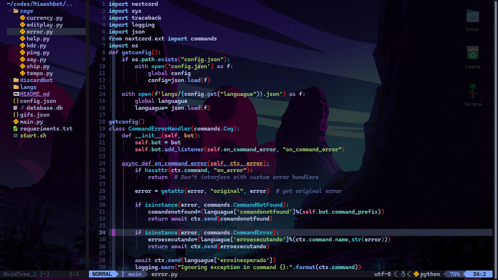

# neovim-config
<p align="center">


</p>
my personal backup from neovim with transparent background


structure:
```
├── init.lua                --INFO: neovim main file 
├── lazy-lock.json
├── lua
│   ├── colorscheme.lua     --INFO: file containing active colorscheme setting
│   ├── keybindings.lua     --INFO: keyboard shortcuts
│   └── plugins             --INFO: folder to put plugins 
└── README.md
```


# Usage:
on linux :
```bash
git clone --depth 1 https://github.com/katsudouki/neovim-config.git ~/.config/nvim && nvim
```
on windows :

```bash
git clone --depth 1 https://github.com/katsudouki/neovim-config.git %LOCALAPPDATA%/nvim && nvim
```
> ❗ **Attention**:<br>
>need to enable transparency in terminal settings to work properly

> ⚠️ on windows you need to install neovim and the c/c++ compilation tools and add them to the path variable

# Keyboard shortcuts :
- ctrl+s to save
- ctrl+z to undo
- ctrl+y to redo
- ctrl+t open terminal inside nvim
- ctrl+\ to switch to next tab

>! **Info**:<br>
> Use the TransparentToggle command to enable or disable transparency without having to modify the configuration in lua.


